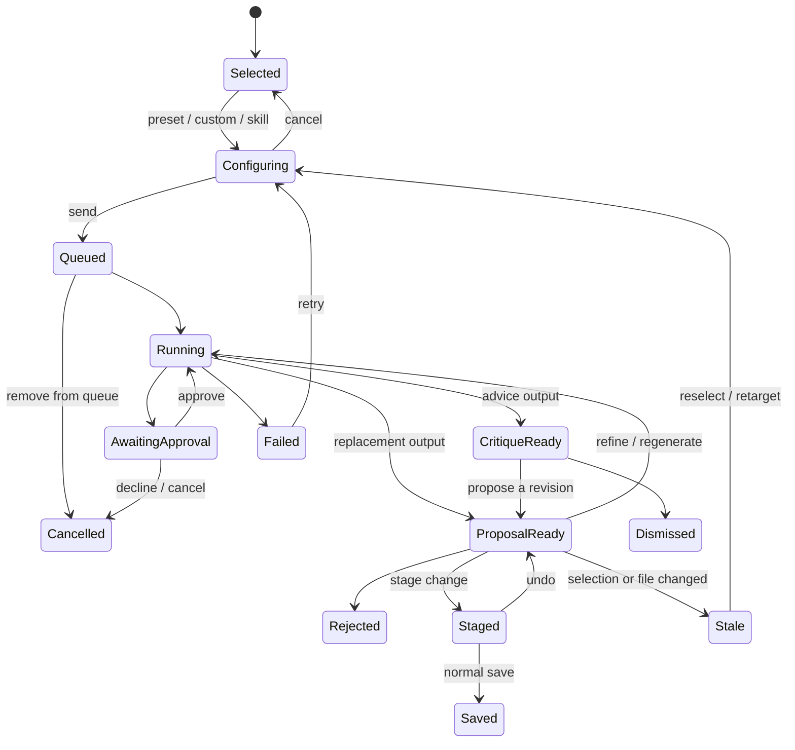

# Selection-aware Codex assistance

## Executive recommendation

Build this feature by **evolving Prosview's existing contextual `···` selection
menu and pairing it with the stable managed-Codex review dock**. Do not add a
second floating toolbar or another selection launcher.

Keep the current pill that appears when the writer selects prose. When opened,
its AI actions should prioritize three high-frequency choices:

1. **Rewrite**
2. **Critique**
3. **Ask Codex**

Preserve the menu's existing **Open in editor**, **Add TODO**, **Skills**, and
**Add Note** commands, grouping them beneath the AI actions or under **More**
after testing the information architecture. A keyboard shortcut should open
this same menu; a separate browser right-click menu is optional, not another
required surface. Choosing an AI action should move longer configuration and
results into the existing right utility dock, where Prosview can show the exact
selection and document context, stream Codex activity, present alternatives or
critique, and let the writer accept, reject, refine, regenerate, copy, or
dismiss.

The central product rule should be:

> Codex may analyze and propose. Prosview alone targets, stages, and saves.

For rewrite-style actions, accepting a suggestion should stage only the
selected replacement in ProseMirror, leave the document dirty, and require the
normal save flow. For critique-style actions, Codex should not generate
replacement prose unless the writer explicitly asks to turn a comment into a
proposal.

This direction combines the strongest patterns from Sudowrite, ProWritingAid,
Type, Lavish, and Skrib while fitting Prosview's local-first architecture. It
also addresses two problems reproduced in the current UI: forms expanded
inside the existing selection menu can fall below the viewport at normal
desktop size, and the `···` pill can become unreachable at 200% zoom.

## Research scope and method

Research was conducted on August 3, 2026 and included:

- the two supplied screenshots, one showing a dense horizontal preset bar and
  one showing ProWritingAid's formatting bar plus contextual Rephrase, Sparks,
  and Critique actions;
- official product documentation and current product pages for Sudowrite,
  ProWritingAid, Type, and Skrib;
- the current `kunchenguid/lavish-axi` repository, including its README and
  text-range annotation implementation at commit
  `7c64184adce8b2b18c1cb072779305303b8079d9`;
- current official Codex app-server documentation;
- the current Prosview repository, product documentation, selection UI,
  managed Discuss implementation, proposal bridge, and browser E2E harness;
- a focused live UI audit in an isolated copy at Prosview commit
  `940404581adf96466d568155f56b2f890e97c38c`.

The audit did not change product code, tests, fixtures, or the E2E harness. The
primary checkout already contained extensive user-owned changes; those were
preserved. Only this research document was added.

## What Prosview already has

Prosview is much closer to this feature than the competitor screenshots might
suggest. The current build already contains most of the difficult trust and
integration infrastructure:

**No new selection launcher is needed.** Throughout this proposal, “selection
menu” means the existing `···` pill and the menu it opens.

| Capability | Current state | Reuse for this feature |
| --- | --- | --- |
| Text selection capture | Scene selection is remembered, including a cloned DOM range and pinned visual highlight | Keep the durable selection model and existing pill; repair positioning and invocation semantics |
| Selection commands | TODO, Note, snippet Skills, Open in editor, and custom Run in Codex | Consolidate writer/AI actions and send managed work to the right dock |
| Managed Codex | One local app-server, document-mapped threads, streaming, progress, plans, approvals, stop, reconnect, and history | Use as the execution and refinement surface |
| Explicit context | Current document, selected text, and optional files/folders appear as removable chips | Preserve and make the context summary part of every action run |
| AI proposals | Exact quote/range resolution, SSE delivery, inline highlight, alternatives, stage-without-save, and stale/conflict protections | Make this the sole rewrite result path |
| Skills | Repository skills are discovered and displayed | Query through app-server `skills/list`; pass a real `skill` input item for reliable invocation |
| Safe saving | ProseMirror dirty state, normal save, mtime conflict guard, and annotation preservation | All accepted prose must continue through this path |

There is one important seam to remove. Today, the selection menu sends custom
instructions and snippet skills into a terminal
([selection implementation](../proseview/templates/assets/js/60-selection.js)),
while the newer managed Discuss dock separately captures the current selection
([Discuss implementation](../proseview/templates/assets/js/68-discuss.js)).
That creates two overlapping mental models for "ask Codex about this passage."

The new feature should make managed Codex the default for selection actions.
The terminal should remain an advanced, general-purpose surface, not the
primary quick-edit experience.

## Competitive findings

### Comparative summary

| Product | Strongest pattern | Weakness or caution | Lesson for Prosview |
| --- | --- | --- | --- |
| Sudowrite | Context-sensitive selection menu, presets plus custom instruction, story-aware Quick Edit, inline compare/refine, and History cards for larger work | Many layered tools and modes can become cognitively heavy | Keep Prosview's existing menu compact; move configuration and results into one stable dock |
| ProWritingAid | Clear separation between sentence rephrasing, paragraph inspiration/editing, and chapter/manuscript critique | Product taxonomy is broad and can feel fragmented | Separate **transform**, **inspire**, and **analyze** by output type and selection size |
| Type | Floating AI command, reusable “Brushes,” custom prompt history, inline suggested edits, granular accept/reject, and strong keyboard shortcuts | Fast acceptance can encourage shallow review | Borrow its review speed, but retain Prosview's explicit staged-save boundary |
| Lavish | Precise selected-text anchors, collision-aware annotation card, queued prompts, preserved unsent input, clear agent presence, and a stable conversation composer | Annotation mode is still primarily pointer-driven | Borrow stable targeting, queue semantics, reload preservation, and agent-status clarity |
| Skrib | Quiet writing surface, AI-free choice, multiple drafts, and optional authorship attestation | Does not solve assisted revision itself | AI must remain opt-in, dismissible, visibly attributed, and separable from human prose |

### Sudowrite

Sudowrite uses selection length to change the available commands. A single word
can expose related words and description tools, while a longer selection adds
Rewrite, Expand, and other passage-level actions. Quick Edit is available both
from the selection menu and with `Cmd/Ctrl+K`, accepts a custom instruction,
and shows the old and proposed prose inline so the writer can accept, reject, or
refine it. The separate Rewrite workflow can generate multiple alternatives in
a right-side History column and offers presets such as Rephrase, Shorter, More
descriptive, Show not Tell, More Inner Conflict, More Intense, and Custom.

Sources:

- [Sudowrite Selection Menu](https://docs.sudowrite.com/using-sudowrite/1ow1qkGqof9rtcyGnrWUBS/selection-menu/of43eZdiHYoyCtrofDerCZ)
- [Sudowrite Quick Edit](https://docs.sudowrite.com/using-sudowrite/1ow1qkGqof9rtcyGnrWUBS/quick-tools/2asL35fds36oHAFJN7bYzz)
- [Sudowrite Rewrite](https://docs.sudowrite.com/using-sudowrite/1ow1qkGqof9rtcyGnrWUBS/rewrite/9hkeezeUsCiUCG4dRdEqjS)

What to borrow:

- selection-aware command relevance;
- both pointer and keyboard invocation;
- presets plus a custom instruction;
- visible original/proposed comparison;
- refine/regenerate without losing the original;
- persistent results for work that outgrows a small inline card.

What not to copy:

- a large root-level tool catalog;
- style imitation presets naming living authors;
- ambiguous commands that may alter story facts;
- result UI that obscures the prose or makes the selection disappear.

### ProWritingAid

ProWritingAid's supplied screenshot shows a useful two-layer model: the normal
formatting toolbar remains separate from the smaller AI/editorial bar attached
to the selection. Its documentation makes task scope explicit:

- Rephrase is sentence-oriented and returns several alternatives across
  Standard, Fluency, Formal, Informal, Sensory, Shorten, Expand, and Emotion.
- Sparks Edit works on longer passages for readability, fluency, transitions,
  sensory detail, summary, point of view, and tense.
- Sparks Inspire provides ideas rather than direct edits.
- Chapter Critique produces analysis in a separate report with exact text
  locations, rather than rewriting the chapter.

Sources:

- [What Is Rephrase?](https://help.prowritingaid.com/article/237-what-is-rephrase)
- [What is Sparks?](https://help.prowritingaid.com/article/244-what-is-sparks)
- [Rephrase versus Sparks](https://help.prowritingaid.com/article/247-what-s-the-difference-between-sparks-and-rephrase)
- [How Chapter Critique works](https://help.prowritingaid.com/article/271-how-do-i-use-chapter-critique)
- [How ProWritingAid distinguishes assistive and generative AI](https://help.prowritingaid.com/article/297-does-prowritingaid-use-ai)

The most useful lesson is not the number of presets. It is that different
writer intents need different result contracts:

- **Rephrase** → alternatives that preserve meaning.
- **Transform** → a bounded replacement with declared changes to length,
  detail, tense, or point of view.
- **Inspire** → ideas that do not alter the manuscript.
- **Critique** → observations, evidence, and next steps with no replacement
  prose by default.

### Type

Type combines a floating AI entry point with “Brushes” for common commands. It
supports custom instruction history, preview and regeneration, direct
comparison, and inline suggestions that can be accepted or rejected
individually. It also gives the review loop first-class keyboard commands:
accept, reject, accept all, next, previous, and dismiss.

Sources:

- [Type: Rewrite any text with AI](https://blog.type.ai/post/ai-rewrite)
- [Type: A faster AI document editor](https://blog.type.ai/post/introducing-a-faster-way-to-edit-with-ai)

Prosview should borrow the fast review loop, especially next/previous and
accept/reject shortcuts. It should not adopt “accept all” until multi-proposal
review has proven safe across annotations, stale files, and unsaved local
edits.

### Lavish

Lavish is not a writing assistant, but it offers the closest interaction model
for precise human-to-agent feedback. It:

- captures selected text plus stable range anchors;
- opens a text-specific annotation card and clamps it inside the viewport;
- lets the user queue several targeted instructions before sending them;
- preserves an open annotation card and unsent text through live reload;
- shows whether an agent is absent or working;
- keeps queued targets visible above a stable composer;
- differentiates “send” from “send and end”;
- keeps detection passive until the user explicitly queues a fix.

Sources:

- [lavish-axi repository and interaction model](https://github.com/kunchenguid/lavish-axi)
- [Text-range targeting implementation at the researched commit](https://github.com/kunchenguid/lavish-axi/blob/7c64184adce8b2b18c1cb072779305303b8079d9/src/artifact-sdk.js)

The strongest transferable idea is a queue of precise, user-authored intents.
Prosview does not need a separate annotation mode, but it should allow writers
to keep working while one or more selection tasks wait in the managed session.
The UI should state whether a task is queued, running, awaiting approval,
ready for review, stale, or complete.

### Skrib

Skrib currently markets the opposite choice: a quiet writing studio with no AI,
multiple drafts, a connected planning board, and optional human-authorship
attestation. It explicitly emphasizes ownership, no model training, and proof
of the human writing process.

Source: [Skrib product page](https://skrib.com/)

Prosview is local-first and therefore has an opportunity to support both
workflows:

- an obvious **AI assistance off** preference;
- no proactive or unsolicited rewriting;
- visible attribution for AI-generated proposals;
- a durable activity record containing action type, selection fingerprint,
  accepted/rejected status, and timestamp, without storing hidden reasoning;
- a future exportable “assistance history” if authorship disclosure becomes a
  user need.

This history should be optional and local. It should not become telemetry.

## Product principles

### 1. Invocation is lightweight; results are stable

The floating surface should help the writer choose a task, then get out of the
way. Custom prompts, long menus, progress, errors, alternatives, and approvals
belong in the right dock.

### 2. Preserve meaning unless the writer chooses otherwise

“Rewrite” is dangerously vague. Every preset needs a stated constraint:

- preserve meaning;
- preserve story facts;
- preserve point of view and tense;
- preserve Markdown and annotations;
- change only the selection.

Transforms that intentionally relax one constraint must say so before running.

### 3. Advice and generation are different modes

Critique should return analysis, evidence, and actionable questions without
silently smuggling in replacement prose. A writer who wants an example can
choose **Propose a revision** from the critique card.

### 4. The original is never lost

The original selection stays visible while work runs. A proposal never writes
the file. Accept stages a ProseMirror edit; normal undo and normal save remain
available.

### 5. Context is visible and bounded

Every action should show:

- selected word count;
- current scene;
- optional attached files/folders;
- invoked skill, if any;
- whether whole-scene context is included;
- the intended result type: critique, alternatives, or transform.

### 6. The writer can recover from every state

Cancel, stop, dismiss, reject, regenerate, refine, undo, and stale-target
recovery must be explicit. Selection drift or an external file change should
never fall back to “best effort” replacement.

### 7. AI remains optional

No automatic run on selection, hover, save, or navigation. Selecting prose
must remain a normal reading and copying action.

## Proposed interaction design

### Entry points

Use one contextual command surface with two equivalent ways to open it:

1. **Existing `···` selection pill and menu** — the primary pointer path.
2. **`Cmd/Ctrl+K` with text selected** — the primary keyboard path, opening
   that same menu.

A native browser right-click alias such as **Work with Codex…** can be tested
later, but it should invoke the same controller and must not introduce another
menu model. In this proposal, “contextual selection menu” refers to the existing
`···` UI, not a new right-click-only feature or newly opened bar.

The scene header can retain a general **Discuss** action for whole-document
questions. The existing selection menu should not require the writer to know
that the general Discuss button can capture a selection.

### Existing `···` selection menu

Recommended root information architecture (not necessarily a horizontal
toolbar):

```text
Rewrite
Critique
Ask Codex
────────────
Skills
Add TODO
Add Note
Open in editor
```

If testing shows that this is too tall, put the lower-frequency existing
commands under **More**. Do not remove them merely to make room for the new AI
actions.

Behavior:

- position above the selection when space allows and below it otherwise;
- use collision detection against the visual viewport, not only
  `window.innerWidth` and `window.innerHeight`;
- keep the selected text visible;
- re-anchor on scroll, resize, zoom, and dock resize;
- dismiss on Escape or an outside click without clearing the browser selection;
- expose an accurate accessible name, `aria-haspopup`, `aria-expanded`,
  and a standard menu-button/listbox interaction;
- open with focus on the first item for keyboard invocation and restore focus
  to the prose/`···` button on dismissal.

Do not keep a multiline text box expanded inside this menu. The focused audit
showed why: the current custom form extended below the viewport even at
1400×1000. **Ask Codex** should transfer the captured selection into the managed
dock and focus the dock's instruction field.

### Wireframes

These are interaction wireframes, not final visual styling. They deliberately
reuse the existing `···` selection pill and right utility dock.

#### 1. Selection and the existing menu

```text
┌──────────────────────────── Scene ────────────────────────────┐
│                                                              │
│  Margot watched the rain gather against the library glass.   │
│  She had been waiting [for seventeen quiet minutes, certain  │
│  that nobody would come].                                    │
│                               [ ··· ]                         │
│                                                              │
└──────────────────────────────────────────────────────────────┘

                                  select prose
                                       ↓

                       ┌─ Work with selection ───────┐
                       │  Rewrite                 ›  │
                       │  Critique                ›  │
                       │  Ask Codex…                  │
                       ├─────────────────────────────┤
                       │  Skills                  ›  │
                       │  Add TODO                   │
                       │  Add Note                   │
                       │  Open in editor             │
                       └─────────────────────────────┘
```

The pill remains the existing compact `···` control. Its accessible name should
be “Work with selected text.” Opening the menu should pin the highlight, place
keyboard focus on the first item, and keep every current non-AI action.

#### 2. Rewrite presets replace the menu contents

```text
                       ┌─ ← Rewrite ─────────────────┐
                       │  Rephrase        3 options  │
                       │  Tighten         2 options  │
                       │  Clarify         2 options  │
                       │  Add sensory detail      ›  │
                       │  Show the moment         ›  │
                       │  Adjust tone/style…         │
                       └─────────────────────────────┘
```

Use an in-place submenu rather than a second sideways flyout; it is easier to
keep inside the viewport. Choosing a deterministic preset starts the managed
task immediately. **Adjust tone/style…** opens the dock because it needs more
input.

#### 3. Ask Codex moves composition into the existing dock

```text
┌──────────────────────── Scene ───────────────────┬─ Codex · Selection ─────┐
│                                                 │  Opening scene · 8 words │
│  She had been waiting [for seventeen quiet      │  ┌─────────────────────┐ │
│  minutes, certain that nobody would come].      │  │ “for seventeen      │ │
│                                                 │  │ quiet minutes…”     │ │
│  The prose stays visible while the writer       │  └─────────────────────┘ │
│  gives Codex an instruction.                    │                         │
│                                                 │  What should Codex do?  │
│                                                 │  ┌─────────────────────┐ │
│                                                 │  │ Make the waiting    │ │
│                                                 │  │ feel more ominous.  │ │
│                                                 │  └─────────────────────┘ │
│                                                 │  Context: [Scene] [×]   │
│                                                 │           [Selection][×]│
│                                                 │       [Cancel] [Run →]  │
└─────────────────────────────────────────────────┴─────────────────────────┘
```

The menu closes after the handoff, while the selected passage remains visibly
pinned. The dock shows exactly what will be sent. Closing the dock preserves an
unsent instruction until the writer dismisses it explicitly.

#### 4. Rewrite results are proposals, not file writes

```text
┌──────────────────────── Scene ───────────────────┬─ Rewrite · Tighten ─────┐
│                                                 │  1 of 3 alternatives    │
│  She had been waiting [for seventeen quiet      │  [1] [2] [3]            │
│  minutes, certain that nobody would come].      │                         │
│                                                 │  Original                │
│  The target remains highlighted until the       │  seventeen quiet minutes│
│  writer stages or rejects the proposal.         │                         │
│                                                 │  Proposed                │
│                                                 │  seventeen silent minutes│
│                                                 │                         │
│                                                 │  −1 word · Not saved     │
│                                                 │  [Reject] [Refine…]      │
│                                                 │  [Stage replacement]     │
└─────────────────────────────────────────────────┴─────────────────────────┘
```

**Stage replacement** updates only the selected range in ProseMirror and leaves
the document dirty. The existing Save and Undo controls remain the authority;
the result card never claims that the file was saved.

#### 5. Viewport-edge and 200% zoom behavior

```text
┌──────────── Constrained visual viewport ────────────┐
│  ┌─ Work with selection ─────────────────────────┐  │
│  │ Rewrite ›   Critique ›   Ask Codex…           │  │
│  │ More…                                           │  │
│  └────────────────────────────────────────────────┘  │
│                         ↑ menu flips above selection │
│  …the door was still [locked]. [ ··· ]               │
└──────────────────────────────────────────────────────┘

Ask Codex opens a reachable overlay at constrained width:

┌──────────────────── Codex · Selection ──────────────┐
│  [Close]  Opening scene · 1 word                    │
│  Selection: “locked”                                │
│  ┌────────────────────────────────────────────────┐ │
│  │ What should Codex do?                          │ │
│  └────────────────────────────────────────────────┘ │
│                                 [Cancel] [Run →]    │
└─────────────────────────────────────────────────────┘
```

At constrained width or 200% zoom, the menu may use a compact first level and
scroll internally if necessary. It must flip and clamp within the visual
viewport. The dock may become a full-viewport overlay, but selection context,
Close, input, and the primary action must all remain visible without
two-dimensional page scrolling.

### Rewrite menu

Keep the first level short:

| Preset | Default contract | Result |
| --- | --- | --- |
| Rephrase | Preserve meaning, facts, POV, tense, and approximate length | 3 alternatives |
| Tighten | Preserve meaning and facts; reduce words and repetition | 2 alternatives plus word-count delta |
| Clarify | Preserve voice and facts; improve comprehensibility | 2 alternatives |
| Add sensory detail | Preserve action and facts; add only grounded sensory detail | 2 alternatives |
| Show the moment | Preserve event outcome; replace summary with observable action/detail | 2 alternatives |
| Adjust… | Choose tone, intensity, POV, tense, or length with a visible constraint warning | 1–3 alternatives |

Avoid both **Improve** and **Rewrite** at the same level; users cannot predict
the difference. Avoid **Change style** as a bare label. Ask for a concrete
attribute such as diction, sentence rhythm, formality, intensity, or a saved
voice profile.

### Critique menu

Recommended options:

- Quick critique
- Voice and character
- Pacing and tension
- Clarity and flow
- Continuity check
- Run a critique skill…

Critique output should be a list of bounded findings. Each finding contains:

- observation;
- quoted evidence from the selected text;
- why it matters;
- one actionable next step;
- optional **Propose a revision**.

No severity inflation, numerical writing score, or generic praise is needed.

### Ask Codex

Choosing **Ask Codex** opens the right dock with:

- a visible chip containing a truncated selection preview and word count;
- the current scene chip;
- optional context attachments;
- a focused custom instruction text box;
- recent custom instructions, local to the user;
- saved prompts/skills surfaced through search rather than a nested side menu.

The writer can ask for analysis, brainstorming, questions, or a transformation.
Before sending, Prosview determines the requested output contract. If intent is
ambiguous, default to advice-only and let the writer explicitly request a
proposal.

### Skills

Skills should be a searchable **More → Skills…** surface with:

- display name;
- short description;
- source: project or user;
- output type badge: Critique, Proposal, Conversation, or Unknown;
- any required dependencies or elevated authority;
- recent/favorite state stored locally.

Use app-server `skills/list` rather than maintaining a second partial parser
for the managed experience. Invoke a chosen skill with a real `skill` input
item so its instructions are injected reliably.

Unknown-output skills should run as conversations until they explicitly create
a valid proposal. A skill must never inherit auto-approval from a quick action.

### Managed dock

Evolve the right utility dock into one coherent Codex workspace. Two reasonable
information architectures are:

- **Codex** with internal sections for Conversation and Changes, plus Terminal;
  or
- top-level tabs **Discuss | Review | Terminal**.

The first is preferable because a rewrite often becomes a conversation and a
critique often becomes a proposed change. The dock header should state the
active task, for example:

`Tighten selection · 63 words · Running`

The dock timeline should group each selection action as a card rather than
rendering it as an ordinary chat bubble:

- action and constraints;
- selection preview and context;
- queued/running/approval status;
- result;
- review controls;
- refinement thread;
- final accepted/rejected/dismissed state.

### Proposal review

For rewrite results:

1. highlight the original range in the prose;
2. show one alternative at a time with previous/next controls;
3. show word-count delta and a compact inline diff;
4. offer **Stage change**, **Refine**, **Try again**, **Copy**, and **Reject**;
5. make **Stage change** the primary action, not “Replace” or “Apply”;
6. after staging, show **Undo** and the normal unsaved editor state;
7. require the normal save command to write the Markdown file.

Keyboard review shortcuts should be available only while the review card is
active and should be shown in the UI:

- `A` stage the current alternative;
- `R` reject;
- `←/→` previous/next alternative;
- `Cmd/Ctrl+Enter` stage;
- `Escape` dismiss the review card without changing prose.

Do not add “accept all” in the first release.

### End-to-end state model



## Context and prompt contract

Every selection action should create a structured host-side request:

| Field | Purpose |
| --- | --- |
| `client_request_id` | Idempotent browser submission |
| `document` | Validated repo-relative scene identity |
| `selection_text` | Exact bounded selected prose |
| `selection_range` | ProseMirror positions plus raw Markdown coordinates/fingerprint when available |
| `document_mtime` | Stale-target detection |
| `action_id` | Stable preset identifier, not a display label |
| `constraints` | Preserve meaning/facts/POV/tense, output count, max growth |
| `skill` | Optional validated skill descriptor |
| `attachments` | Explicit additional files/folders |
| `include_current_document` | Visible writer-controlled scope |
| `output_type` | `critique`, `alternatives`, or `conversation` |

The model prompt should distinguish data from instructions. Document content is
untrusted reference material. The selected text should be delimited and the
action constraints supplied by Prosview, not concatenated into a sentence such
as “Run X on \\"selection\\" in @path.”

## Managed Codex technical design

### Use app-server structured output for v1

The current official [Codex app-server
documentation](https://learn.chatgpt.com/docs/app-server) describes app-server
as the rich-client integration surface for authentication, history, approvals,
and streamed events. It also supports a turn-specific `outputSchema`.

Use that stable, host-controlled result channel:

1. Prosview opens or resumes the document's managed thread.
2. It starts a turn with the selected text, visible context, action
   constraints, and a strict `outputSchema`.
3. Codex remains in the current read-only sandbox.
4. Prosview parses and validates the structured final answer.
5. Prosview revalidates the selection fingerprint/range and creates an
   in-memory proposal itself.
6. The browser reviews and stages the proposal through the existing
   ProseMirror path.

This is safer and simpler than granting the agent write access or asking it to
call `proseview propose` over localhost.

Example result shapes:

```json
{
  "kind": "alternatives",
  "summary": "The paragraph repeats the same temporal beat.",
  "alternatives": [
    {
      "text": "Validated replacement prose.",
      "rationale": "Removes repetition while preserving the event order."
    }
  ]
}
```

```json
{
  "kind": "critique",
  "findings": [
    {
      "observation": "The reaction arrives before its cause is clear.",
      "evidence": "Short exact quote from the selection.",
      "why_it_matters": "The emotional beat is harder to follow.",
      "next_step": "Clarify what the character notices first."
    }
  ]
}
```

The host must enforce:

- exact schema and bounded string/array sizes;
- maximum alternative count;
- no Markdown/frontmatter outside the selected prose;
- selection/document identity;
- no empty or identical replacement;
- no accidental TODO/NOTE deletion;
- no file write on result receipt.

### Keep experimental dynamic tools out of v1

App-server also documents experimental dynamic tools that can call back into
the client. A future `proseview.propose_selection_edit` tool could let Codex
submit proposals during a longer conversation. It is attractive for free-form
agent work, but it should not be the dependency for the first preset workflow.

If adopted later:

- negotiate `experimentalApi` capability at runtime;
- generate schemas from the installed Codex version;
- expose only a narrow proposal tool, not arbitrary file writes;
- validate every argument in Prosview;
- display the tool activity in the managed dock;
- retain a structured-output fallback.

### Conversation strategy

Use the existing per-document thread for continuity, but visually group action
runs. This allows “make option two less formal” to be a normal follow-up while
keeping the action result structured.

Each rewrite/refinement turn should set its own `outputSchema`. General
discussion turns can continue without one. New selection actions should not
implicitly reuse an earlier selection; every card owns a selection fingerprint.

### Proposal lifecycle

Extend the existing proposal model rather than creating a second suggestion
system:

- add `origin = managed_selection_action`;
- add `client_request_id`, `action_id`, and selection fingerprint;
- preserve alternatives, rationale, and constraint metadata;
- retain one browser owner for focus/staging;
- mark stale instead of attempting fuzzy replacement;
- make stage/undo/save transitions explicit;
- keep transient proposal state in memory for v1.

### Skills

For managed runs:

1. call app-server `skills/list` scoped to the current repository;
2. display enabled skills and interface metadata;
3. pass the chosen skill as both a visible selection and a `skill` input
   item;
4. retain Prosview's output schema and safety constraints around the skill;
5. show skill dependencies before execution;
6. never assume that a skill is safe to write merely because it is installed.

### Trust and security

- Keep app-server on stdio under the Prosview process.
- Keep selection actions read-only from Codex's perspective.
- Preserve `approvalPolicy: on-request` for tool and command requests.
- Do not expose an “Auto-approve changes” checkbox in the quick-selection
  flow.
- Treat manuscript text as untrusted data, never agent instructions.
- Validate paths under the configured repository/manuscript roots.
- Bound selected text, attachments, output sizes, queues, and turn duration.
- Show exactly what Codex receives before the user sends.
- Store no raw reasoning; retain only safe progress summaries and final output.
- Make assistance history local, optional, and clearable.

## Accessibility and interaction requirements

Apply WCAG 2.2 AA to this core workflow. In particular:

- The existing `···` selection menu needs a named button and a standard keyboard
  invocation. WAI's [Menu Button
  Pattern](https://www.w3.org/WAI/ARIA/apg/patterns/menu-button/) is the
  appropriate interaction reference.
- Focused and opened controls must remain visible. WCAG's [Focus Not Obscured
  guidance](https://www.w3.org/WAI/WCAG22/Understanding/focus-not-obscured-minimum)
  is directly relevant to the contextual menu and dock.
- Targets must meet the [24×24 CSS pixel minimum or a valid spacing
  exception](https://www.w3.org/WAI/WCAG22/Understanding/target-size-minimum).
- The workflow must work at 1400×1000, 1024×768, and 200% zoom in light and
  dark themes.
- Selection, pending, error, result-ready, staged, saved, and stale states
  cannot rely on color alone.
- Status changes need a bounded live region. Streaming prose should not cause
  continuous disruptive announcements; announce state milestones instead.
- The dock should preserve logical focus, support Escape where safe, and
  restore focus to the `···` button or selected prose.
- Re-anchoring should respect `prefers-reduced-motion`.
- The selected text and alternative diff must be available as text, not only
  as visual highlights.

Microsoft's validated [Guidelines for Human-AI
Interaction](https://www.microsoft.com/en-us/research/?p=564561) reinforce the
same product requirements: make capability and fallibility clear, support
efficient invocation and dismissal, and make correction easy.

## Failure and recovery states

| State | Required behavior |
| --- | --- |
| No selection | Explain that the action needs selected prose; do not run on the whole scene silently |
| Selection too large | State the supported size and offer Critique whole scene or shorten selection |
| Codex unavailable | Preserve the custom instruction and selection card; offer Retry |
| Queued | Show queue position and allow removal |
| Slow turn | Show stable activity, Stop, and preserved input |
| Approval requested | Name the command/action, scope, and consequence; move focus to the decision |
| Invalid structured output | Do not create a proposal; offer Retry and show a plain-language error |
| Empty/identical alternative | Filter it and request another if no valid option remains |
| Ambiguous range | Mark stale/needs reselect; never guess |
| External file change | Preserve result, block staging, and offer reopen/reselect |
| Unsaved local edit | Resolve against the live ProseMirror document; never overwrite it from the server |
| Navigation during run | Keep task in dock, retain original document identity, and do not focus another scene unexpectedly |
| Reload | Restore conversation/action cards and selection metadata where valid; mark visual range unverified until re-resolved |
| Stop/cancel | Distinguish stopping generation from dismissing an already produced result |

## Preset configuration model

Do not hard-code prompt text and display strings throughout browser JavaScript.
Define actions as data, for example:

| Property | Example |
| --- | --- |
| id | `rewrite.tighten` |
| label | Tighten |
| category | Rewrite |
| output type | alternatives |
| minimum/maximum selection | 1 / 1,500 words |
| alternative count | 2 |
| constraints | preserve facts, POV, tense; reduce length |
| context policy | selection + current scene |
| skill | optional |
| icon | decorative token from the existing system |
| shortcut | optional |

Project-level customization can come later through `.proseview.yaml`, but the
first release should ship a small, opinionated set and learn from actual use.

## Implementation sequence

### Phase 0 — repair the selection foundation

- Refactor the existing pointer-only `mouseup` path behind a shared
  selection-command controller without replacing the `···` menu or dropping
  its current commands.
- Add keyboard invocation of that same menu; treat a native right-click alias
  as an optional follow-up.
- Implement visual-viewport collision handling and resize/zoom re-anchoring.
- Add menu semantics, focus management, and status announcements.
- Move multiline Codex input out of the menu and into the managed dock.
- Add targeted browser tests for edge placement and 200% zoom.

### Phase 1 — managed custom instruction, advice-only

- Route **Ask Codex** into the existing managed dock.
- Carry a durable selection fingerprint and explicit context chips.
- Add action-card grouping and preserve input across close/reload.
- Default ambiguous requests to conversation/critique, not replacement.
- Remove quick-flow auto-approve.

### Phase 2 — preset rewrites with structured alternatives

- Add action definitions and turn-specific `outputSchema`.
- Validate structured results server-side.
- Convert valid alternatives into the existing proposal model.
- Add Stage, Reject, Refine, Try again, Copy, Undo, and stale-target behavior.
- Keep save explicit.

### Phase 3 — critique and skills

- Add critique schemas and evidence-linked cards.
- Add “Propose a revision” as an explicit transition.
- Integrate app-server `skills/list` and real `skill` input items.
- Add favorites/recent custom instructions locally.

### Phase 4 — queues and optional assistance history

- Support multiple queued selection tasks.
- Add next/previous proposal review.
- Add local export/clear controls for assistance history.
- Evaluate experimental dynamic tools only after capability and compatibility
  testing.

## Acceptance criteria

### Functional

- Selecting prose exposes the same `···` menu action set by pointer and
  keyboard. If a native right-click alias ships, it invokes that same action
  model.
- Presets and custom instructions send the exact selected text, current
  document, and only explicit additional context.
- Critique cannot alter the manuscript.
- Rewrite results become proposals; receiving a result does not edit or save.
- Staging changes only the resolved selected range in ProseMirror.
- Undo restores the exact original.
- Save uses the existing mtime guard and preserves frontmatter, annotations,
  emphasis, and untouched prose.
- Duplicate submission is idempotent.
- Reload/navigation preserves or safely invalidates every task state.

### UX and accessibility

- The `···` menu, custom composer, review controls, and recovery paths are
  operable without a pointer.
- Controls remain fully reachable at 1400×1000, 1024×768, and 200% zoom in
  light and dark themes.
- Focus is visible and restored.
- Accessible names, roles, expanded/selected/disabled states, and milestone
  announcements are correct.
- No fixed or floating surface obscures the focused control or selection.
- The original, proposal, difference, status, and file-write boundary are
  understandable without color.

### Trust and reliability

- Codex runs read-only for preset selection actions.
- No quick-selection auto-approval exists.
- Every proposal validates file, range, fingerprint, and mtime before staging.
- External changes and ambiguous targets block staging.
- Errors preserve the instruction and original selection metadata.
- No real manuscript is touched by tests.

### Test matrix

At minimum, browser E2E coverage should include:

- selection near every viewport edge;
- long wrapped selection and one-word selection;
- pointer and keyboard invocation of the existing `···` menu, plus native
  context-menu invocation if that optional alias ships;
- light/dark, 1400×1000, 1024×768, and 200% zoom;
- custom instruction, every preset output type, and one project skill;
- queue, stop, approval, unavailable Codex, malformed structured output, and
  retry;
- stage, reject, refine, regenerate, undo, save, conflict, external change,
  reload, and navigation;
- annotated Markdown, emphasis, large scene, repeated quote, and stale range;
- accessible names/roles/state, focus order/recovery, and live announcements;
- console errors, failed requests, and exact isolated file effects.

## Product risks and mitigations

| Risk | Mitigation |
| --- | --- |
| Voice flattening | Preserve-voice constraints, multiple alternatives, critique-first option, explicit human review |
| Meaning drift | Preset contracts, rationale, diff, story-fact constraint, no direct writes |
| Feature overload | Prioritized AI group inside the existing menu, progressive disclosure, searchable More/Skills |
| Hidden context leakage | Visible/removable chips, bounded context, current document only by default |
| Over-trust in critique | Avoid scores and certainty language; require quoted evidence and writer judgment |
| Accidental AI authorship | AI-off mode, attribution, stage/save boundary, optional local assistance history |
| Long-running agent disruption | Stable dock, queue, stop, preserved selection, non-modal writing surface |
| App-server protocol drift | Generate/inspect installed schemas, capability negotiation, structured-output fallback |
| Experimental-tool lock-in | Keep dynamic tools out of v1 |
| Selection drift | Fingerprints, exact range validation, stale state, no fuzzy apply |

## Non-goals for the first release

- whole-manuscript generative rewriting;
- automatic suggestions while typing;
- proactive AI on selection or save;
- direct agent file writes;
- cross-file patch review;
- provider parity with Claude or Gemini;
- author-style imitation presets;
- “accept all” across multiple proposals;
- cloud telemetry or server-side prompt history;
- automatic authorship certification.

## Success signals

Keep measurement local unless the user explicitly opts into telemetry. Useful
manual/usability signals are:

- time from selection to first useful result;
- percentage of runs dismissed, refined, copied, staged, undone, and saved;
- number of refinements before staging;
- stale-target and invalid-output frequency;
- keyboard completion rate;
- whether users can accurately state when the file changed;
- whether writers choose critique more often than direct rewrite;
- qualitative voice-preservation and trust feedback.

A high acceptance rate is not automatically success. Frequent unreviewed
acceptance can indicate over-trust. The more meaningful outcome is that writers
can reach a useful, intentional revision without losing their voice or their
original prose.

## Decisions to make before implementation

1. Name the unified surface: **Codex**, **Discuss**, or **Assistant**.
   Recommendation: **Codex**, with Conversation and Changes inside it.
2. Decide whether action runs share the existing document thread.
   Recommendation: yes, visually grouped and selection-fingerprinted.
3. Choose the initial presets.
   Recommendation: Rephrase, Tighten, Clarify, Add sensory detail, Show the
   moment, Quick critique, and Custom.
4. Decide selection limits after evals.
   Recommendation: conservative defaults with an alternate whole-scene
   critique path.
5. Decide whether optional assistance history belongs in v1.
   Recommendation: record only in-memory action state initially; design a local
   export/clearable log later.

---

# Appendix A — focused Prosview UI audit

## Outcome and executive verdict

**Incomplete.** The live audit confirms that the managed Discuss dock is a
strong foundation for selection-aware Codex work: it opened by keyboard,
retained an explicit selection chip, stayed within the tested desktop
viewport, restored focus, and used a safe live log. The current floating
selection surface is not a safe foundation for richer commands because its
custom form can render below the viewport and its trigger becomes unreachable
at 200% zoom. The focused audit did not measure end-to-end latency, and the
requested managed preset workflow does not exist yet, so the completion gate
cannot pass.

## Scope and environment

- Repository: `/Users/ari/github/prosview`
- Commit: `940404581adf96466d568155f56b2f890e97c38c`
- Worktree: extensive pre-existing modified and untracked work, including the
  managed Discuss and E2E surfaces; preserved without attribution or rollback
- Scope: selection invocation, custom selection instruction, managed Discuss
  handoff, accessibility, responsive placement, and trust boundaries relevant
  to the proposed feature
- Harness source: `CONTRIBUTING.md`, `pyproject.toml`,
  `tests/e2e/conftest.py`, and `tests/e2e/test_browser_e2e.py`
- Browser: installed Playwright Chromium
- Runtime: Python 3.13.3, pytest 8.4.1
- Contexts attempted: 1400×1000 light/pointer, 1400×1000
  light/keyboard-opened Discuss, and 1024×768 dark at 200% CSS zoom
- Isolation: rsynced disposable working-tree copy; generated demo manuscript,
  fake Codex executable, fake home, and temporary server
- Input methods: pointer for selection UI; keyboard for managed Discuss open,
  send, context-picker dismissal, and close/focus recovery through the existing
  suite
- Excluded: full dashboard audit, mobile product quality, real Codex/model
  quality, production manuscript, and implementation of the proposed feature

### Capability-by-state matrix

| Capability | Entry state | Transition exercised | Outcome/recovery | Data boundary | Status |
| --- | --- | --- | --- | --- | --- |
| Existing selection menu | Scene reading, selected prose | Pointer selection → `···` pill → menu | Menu opened; Escape dismissal covered | Browser selection only | Covered |
| Custom terminal instruction | Selected prose, menu open | Run in Codex → custom form | Focus moved to input, but form extended below viewport | Selected text + scene sent to local terminal agent | Covered with finding |
| Selection at zoom | Scene reading, dark, 1024×768, 200% | Select prose → locate trigger | Trigger placed outside viewport; task could not continue | Browser selection only | Covered with finding |
| Managed selection discussion | Selected prose | Keyboard-open Discuss → send question | Explicit scene/selection context, live response, safe rendering | Current document + captured selection | Covered |
| Proposal staging/saving | Existing proposal bridge | Baseline suite exercised proposal lifecycle | Staged before save with file-safety tests | Isolated fixture file | Supporting evidence; not a new action journey |
| Managed preset rewrite | Selected prose | Not available in current product | Design target only | N/A | Not verified |

## Baseline E2E health gate

Command, discovered in `CONTRIBUTING.md`:

`PROSEVIEW_ESM_OFFLINE=1 PYTHONPATH="$PWD" python3 -m pytest -m e2e_browser`

Result:

- 341 collected
- 95 selected
- 246 deselected
- 94 passed
- 1 failed
- duration: 95.47 seconds

The failure was
`test_discuss_scene_streams_safe_document_aware_conversation`, which waited
to observe a transient “Reconnecting” label after immediately reopening the
event stream. A targeted rerun reproduced the same assertion failure in 31.31
seconds. The live product had already transitioned back to “Live,” and the
remaining Discuss assertions and 94 other browser tests passed. Classification:
**suspected harness timing failure**, not evidence that reconnect failed for
the user. It still makes the baseline red and must be reported.

## Lane scorecard

| Lane | Status | Highest severity | Evidence note |
| --- | --- | --- | --- |
| Information architecture and discoverability | Needs work | P2 | Selection work is split between an unlabeled pill/terminal path and managed Discuss |
| Core workflow effectiveness and correctness | Fail | P1 | The current selection action cannot be completed when the trigger or form is outside the viewport |
| Interaction behavior, feedback, and recovery | Fail | P1 | Floating placement does not account for expanded content or zoom |
| Accessibility and keyboard usability | Fail | P1 | Pointer-only selection invocation, unnamed `···` button, absent menu semantics, and zoom reachability failure |
| Visual design and data visualization | Needs work | P2 | Compact default menu is readable, but expanded layouts are not collision-safe |
| Content design and cognitive load | Needs work | P2 | “···”, “Run,” and overlapping terminal/Discuss concepts do not explain task or outcome |
| Performance and perceived responsiveness | Not verified | — | No representative managed-action latency measurement was taken |
| Trust, data safety, and local-first clarity | Needs work | P2 | Managed context/proposal boundaries are strong; quick-flow auto-approve conflicts with proposal-first safety |

## Prioritized findings

### UX-001 — Selection actions become unreachable at desktop zoom and near the viewport edge

- Severity: P1
- Lane: Accessibility and keyboard usability
- Evidence: Observed
- Workflow: Select prose and open a custom Codex action
- User impact: Writers using 200% zoom cannot reach the selection action at
  all; writers at normal desktop size can focus a custom form whose controls
  extend below the viewport.
- Expected: The existing `···` button and every opened surface remain fully
  reachable; the menu re-anchors above/below the selection and longer work
  moves into the stable dock.
- Observed: At 1400×1000, the custom form began at y=877.375 with height=141,
  extending past the viewport. At 1024×768 with 200% CSS zoom, the pill was at
  x=1722.75 and y=1436 and Playwright reported it outside the viewport.
- Reproduction:
  1. Open `ch01/01-opening.md` in the isolated fixture at 1400×1000, light
     theme, pointer input.
  2. Select “the slow algebra,” open the pill, and choose Run in Codex.
  3. Observe that the focused form extends below the viewport.
  4. Switch to dark theme, 1024×768, and 200% CSS zoom.
  5. Select “It is sticking again.”
  6. Observe that the selection trigger is outside the viewport and cannot be
     clicked normally.
- Corroboration:
  [selection placement logic](../proseview/templates/assets/js/60-selection.js)
  clamps only the collapsed pill against window dimensions; the absolutely
  positioned menu and nested form expand downward.
- Confidence: High
- Recommendation: Keep the existing `···` pill and its compact,
  collision-aware menu near the selection. Move custom Codex input and results
  into the managed right dock. Anchor the existing surface using the visual
  viewport and re-evaluate position after content, viewport, zoom, scroll, and
  dock-size changes.
- Acceptance check: Complete selection → custom instruction at 1400×1000,
  1024×768, and 200% zoom with selections at all four viewport edges, in both
  themes, without clipping, two-dimensional page scrolling, or obscured focus.

### UX-002 — The selection command surface is not discoverable or operable as an accessible menu

- Severity: P1
- Lane: Accessibility and keyboard usability
- Evidence: Source-confirmed risk
- Workflow: Invoke a selection action without a pointer or with assistive
  technology
- User impact: Keyboard and screen-reader users do not have an equivalent
  entry point into a core AI/annotation workflow and cannot determine what the
  “···” button or opened container represents.
- Expected: The existing `···` control is a named menu button that opens from
  pointer and keyboard, with standard roles, state, focus movement, and
  dismissal. Any optional right-click alias opens the same action model.
- Observed: The live DOM exposed no `aria-label` on the “···” button and no
  role on the opened menu. Source binds creation to `mouseup` in the scene and
  does not provide a keyboard selection-command entry point.
- Reproduction:
  1. Open a scene and select text with the pointer.
  2. Inspect the selection button accessible name and the opened menu role.
  3. Observe a null explicit name and null menu role.
  4. Inspect the event path in `60-selection.js`; invocation is attached to
     the scene body's `mouseup` event.
- Corroboration:
  [selection markup and event handling](../proseview/templates/assets/js/60-selection.js)
- Confidence: High for semantics and source path; the exact impact for each
  assistive technology was not separately tested.
- Recommendation: Put the existing `···` UI behind a shared selection-command
  controller, add `Cmd/Ctrl+K`, give its button an accessible name and
  `aria-haspopup`, and implement WAI-ARIA menu-button/listbox keyboard behavior.
- Acceptance check: A keyboard-only user can select prose, open the command
  surface, choose Rewrite/Critique/Custom, dismiss it, and recover focus; an
  accessibility-tree inspection reports correct name, role, expanded state,
  item names, and selection state.

### UX-003 — Selection work is split across terminal and managed Codex surfaces

- Severity: P2
- Lane: Information architecture and discoverability
- Evidence: Source-confirmed risk
- Workflow: Ask Codex to work on selected prose
- User impact: Writers must predict whether “Run in Codex,” Skills, or Discuss
  provides the desired history, context controls, approvals, proposals, and
  result UI. Similar tasks lead to different experiences.
- Expected: Selection actions share the managed document thread, explicit
  context, progress, approvals, and proposal review. Terminal remains an
  advanced escape hatch.
- Observed: Selection Skills and Run in Codex call the terminal launcher,
  while Discuss independently captures the same selection into its managed
  dock.
- Reproduction:
  1. Select prose and inspect the selection menu.
  2. Choose Run in Codex and observe a terminal-oriented custom form.
  3. Return to the scene, select prose, and invoke Discuss.
  4. Observe a separate managed conversation with selection and scene chips.
- Corroboration:
  [selection terminal routing](../proseview/templates/assets/js/60-selection.js)
  and [managed selection capture](../proseview/templates/assets/js/68-discuss.js)
- Confidence: High
- Recommendation: Route quick selection actions and skills into managed Codex
  by default and surface proposal results in the shared review dock.
- Acceptance check: Every selection preset/custom/skill run appears in one
  managed document history with identical context, approval, stop, reconnect,
  and proposal semantics; no terminal knowledge is required.

### UX-004 — Quick selection exposes broad auto-approval before a safe review path

- Severity: P2
- Lane: Trust, data safety, and local-first clarity
- Evidence: Source-confirmed risk
- Workflow: Run a custom Codex instruction on selected prose
- User impact: A writer can opt into broad `--full-auto` authority from a
  compact passage menu even though the intended action should only analyze or
  propose a bounded change.
- Expected: Quick selection actions run read-only and return a reviewable
  proposal. Elevated authority remains in an advanced, consequence-labeled
  terminal workflow.
- Observed: The custom selection form includes “Auto-approve changes,” and the
  browser E2E contract launches Codex with `--full-auto` when checked.
- Reproduction:
  1. Select prose and open Run in Codex.
  2. Observe the Auto-approve changes checkbox beside the custom action.
  3. Check it and run; the current E2E contract verifies `--full-auto`.
- Corroboration:
  [custom selection form and launch](../proseview/templates/assets/js/60-selection.js)
- Confidence: High
- Recommendation: Remove auto-approval from the quick-selection flow. Keep
  Codex read-only, validate structured results in Prosview, and stage proposals
  only after explicit review.
- Acceptance check: No preset/custom/skill quick action can gain file-write or
  broad command authority without a separate, consequence-specific approval;
  receiving or staging a proposal never saves the file.

## Evidence-backed strengths

1. **Managed context is explicit.** The live keyboard-opened Discuss flow
   showed the current scene and “Selected text: ledger,” focused the composer,
   stayed inside the viewport, and used a polite live log.
2. **The managed rendering boundary is safe.** The live probe produced no
   console errors, failed requests, or injected script nodes when rendering the
   fake Codex response.
3. **Proposal safety already matches the desired product rule.** The browser
   suite covers inline proposal highlighting and stages accepted text without
   writing the fixture file until the writer saves.

## Hypotheses and unverified risks

- A dense root-level preset bar like the supplied dark screenshot may obscure
  prose and overload new users. In the existing menu, test a prioritized
  three-action AI group plus **More** against exposing six to eight AI actions
  at once.
- Three alternatives may improve agency, but may also slow small edits. Test
  one versus three based on preset type.
- Reusing the document's main thread should improve refinement, but action
  cards may clutter general discussion history. Test grouped cards versus a
  separate Changes subview.
- Structured-output reliability and latency with real Codex were not tested.
  Run model evals across passage sizes, presets, malformed prose, and skills.
- The current reconnect E2E assertion appears to miss a very short transient
  state. Instrument the actual sequence before changing product behavior.

## Limitations

- The audit was focused, not a full-product review.
- No real Codex process, network, or user profile was used.
- Model output quality, token use, and latency were not evaluated.
- A CSS zoom technique matched the current browser suite; a separate browser
  zoom and OS text-scaling pass remains advisable.
- The proposed managed preset workflow does not yet exist and therefore could
  not be completed live.
- Screen-reader testing was not performed; semantic risks are based on live DOM
  inspection and source corroboration.
- The baseline remained red because of one reproducible reconnect-state timing
  assertion.

## Self-check

- [x] Every in-scope lane was covered or marked `Not verified`/out of scope —
  all eight lanes appear in the scorecard.
- [x] Current commands, routes, selectors, fixtures, themes, features, and
  harness capabilities were discovered rather than assumed — repository docs,
  source, metadata, and current harness were inspected.
- [x] Every required focused workflow was exercised or explicitly listed as
  unverified — managed preset rewrite is named as unavailable.
- [x] A discovered capability-by-state matrix proves complete material tasks —
  the matrix separates the existing selection menu, custom form, Discuss,
  proposal support, and unavailable preset journey.
- [x] Universal, persistence, safety, and accessibility claims were challenged
  — viewport edges, 200% zoom, reload/reconnect tests, explicit context, and
  stage-before-save behavior were checked.
- [x] The baseline E2E command, result, environment, and failure classification
  were reported.
- [x] Every focused context activated by the requested workflow was attempted —
  primary desktop, compact desktop, dark theme, zoom, pointer, and keyboard
  Discuss entry were covered.
- [x] Applicable theme/input contexts were attempted and exclusions are
  trace-justified — screen reader and keyboard text-selection invocation remain
  limitations, with source-confirmed findings.
- [x] Console errors, failed requests, focus behavior, and isolated file effects
  were observed where applicable — none occurred in the custom probe; file
  effects were covered by the baseline proposal tests.
- [x] Interactive success was based on visible operability and completed user
  outcomes — off-viewport controls were treated as failures despite DOM
  presence.
- [x] Findings are evidence-labeled, reproducible, deduplicated, and calibrated
  by user impact.
- [x] Every recommendation has an observable acceptance check.
- [x] Hypotheses, source-confirmed risks, and observed defects are separated.
- [x] Limitations, harness failures, and untested states are explicit.
- [x] No real manuscript, Prosview product file, test, or E2E harness file was
  changed by the audit — only this user-requested research document was added
  after the isolated audit.
- [x] Browser contexts, servers, terminals, event streams, and temporary audit
  processes were stopped.
- [x] The snapshot manifest matched the final primary product/harness checkout,
  and the disposable audit and competitor-research directories were removed.

**Completion gate: not passed. Audit outcome remains Incomplete because
performance and the not-yet-built managed preset journey were not verified.**

---

## Implementation addendum — 2026-08-03

The completion statement above records the pre-build audit snapshot. The
recommended managed selection journey has now been implemented through Phases
1–4 and independently re-reviewed.

### Delivered experience

- The existing selection `···` control now opens a small, keyboard-operable
  root menu for **Rewrite**, **Critique**, **Ask Codex**, **Skills**, TODOs,
  notes, and editor navigation. Rewrite and critique presets stay in-place in
  accessible submenus instead of obscuring the prose with a wide toolbar.
- Ask, custom rewrite, and skill actions hand the exact selected passage into
  the managed Codex dock. Unsent instructions survive close/reload, recent and
  favorite instructions are available locally, and real skills come from the
  app-server `skills/list` contract.
- Preset rewrites return strict structured alternatives. Prosview presents one
  option at a time in a focused proposal-review dialog with rationale,
  previous/next navigation, keyboard shortcuts, refine/retry/copy/reject, and
  an explicit **Stage change** action.
- Staging changes only the mapped live ProseMirror range. It never writes the
  manuscript automatically. Inline marks are restored exactly by Undo; normal
  scene saving is required to reach disk, and managed history moves from
  `staged` to `saved` only after that save succeeds.
- Dirty editor content is sent only as a bounded, base-mtime-checked live
  snapshot. This lets an action begin after local unsaved edits without
  overwriting or silently retargeting them. External file changes still make
  the proposal stale.
- Critique results are evidence-linked and advice-only until the writer asks
  for a revision. Multiple actions can queue, each pending item can be removed,
  and task cards expose ready/running/staged/saved/rejected/dismissed/stale/
  failed/cancelled history with export and confirmed clear controls.
- At compact desktop and 200% CSS zoom, proposal review becomes the single
  foreground work surface so it remains fully reachable rather than colliding
  with the Codex dock.
- During an active turn, the dock exposes **Stop Codex** and explains why a new
  conversation is unavailable. Conversation reset uses a primary **Starting…**
  state, announces progress, reports slow or failed resets, and restores focus
  to an actionable **Try again** control after failure.

### Safety and protocol decisions

- Codex turns use the managed app-server, read-only sandboxing, network off,
  strict per-action `outputSchema`, bounded parsing, and real `skill` input
  items.
- Selection targets carry a normalized visible-text range, source mtime,
  document identity, and fingerprint. The browser rechecks the live decorated
  range immediately before staging; the server rejects changed files.
- Critique evidence must be a contiguous excerpt of the selection. Validation
  tolerates presentation-only differences in typographic quotation marks, one
  balanced outer quote wrapper, and collapsed whitespace; it does not use
  fuzzy matching and still rejects paraphrases or invented evidence.
- When a critique citation is invalid, the failed card identifies the citation
  that was not found. **Try again** links the new attempt to the original and
  shows only the latest card, with prior attempt statuses in an expandable
  history, so recovery does not create duplicate-looking failures.
- Replacements that introduce frontmatter or TODO/NOTE annotations are
  rejected.
- Duplicate client request IDs are idempotent, including retries after the
  source file changes.
- On reopen, persisted selection-action turns are reconstructed as task cards
  instead of exposed as raw JSON. New turns persist their original mtime,
  range, and fingerprint in a versioned prompt marker, so review remains
  available only when the original target can still be proven current. Legacy
  history without that provenance remains readable but is explicitly
  historical and cannot be applied to a newly baselined scene.

### Final verification

- Independent specification and engineering review: **Approved; no blocking
  findings**.
- Independent live UI/UX review: **Complete — approve; no P0–P3 findings**
  across 1400×1000 light/100%, 1024×768 dark/200%, pointer, and keyboard
  contexts.
- Full default test suite: **265 passed, 126 deselected**.
- Full browser E2E suite: **126 passed, 265 deselected**.
- JavaScript syntax checks, Python compilation, and `git diff --check`: passed.
- Added E2E coverage includes dirty-before-selection actions, repeated text,
  Markdown emphasis and exact Undo, unrelated local edits before staging,
  explicit save lifecycle, multiple staged tasks saved together, queue item
  removal, draft reload, focus recovery, submenu keyboard behavior, dark 200%
  zoom containment, real-world critique punctuation/whitespace variants,
  invalid citations, actionable citation errors, and grouped retry attempts.
  Restart coverage now stops and relaunches the real Prosview server, restores
  HTML-escaped Codex history, verifies both provenance-backed review and safe
  legacy-history rendering, decodes Markdown text entities such as
  `Patel&#39;s` without activating unsafe HTML or links, and confirms that no
  raw payload reaches the chat.
  New-conversation recovery also clears configured action, retry, skill, and
  auto-run state before returning the composer to normal Ask mode; active-turn
  explanation, Stop Codex feedback, pending/failure announcements, retry focus,
  and dark 200% zoom are covered as well.

The implementation gate for Phases 1–4 is therefore **passed**. Real-model
output-quality, latency, and token-cost evaluation remain product-evaluation
work rather than implementation blockers.
